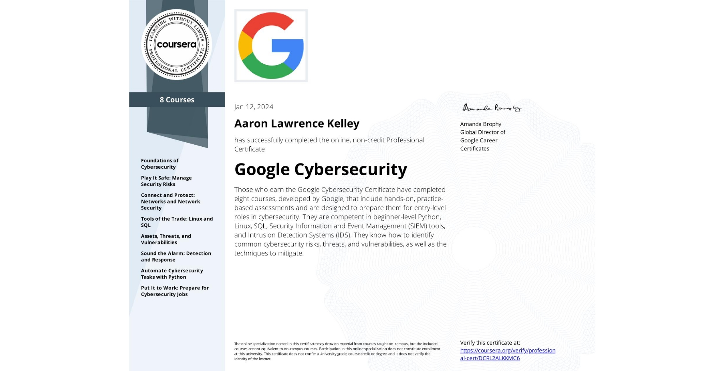

# Google Cybersecurity Professional Certificate

This is where I've compiled all my notes and write-ups from my exams and labs from the [Google Cybersecurity Professional Certificate](https://grow.google/certificates/cybersecurity/#?modal_active=none) course on Coursera.

You can view my certificate of completion on [Coursera](https://coursera.org/share/18ec08b48083c84b9269601148f8b344).

In this course, I gained foundational knowledge that will prepare me for entry-level jobs in cybersecurity and help me understand how security teams protect their organizations and its customers, among a multitude of other essential skills for use in the IT and networking industry.

This course covered many conceptual topics such as:
  * Risk management
  * Threat analysis
  * Network security
  * Incident response

It also taught me technical skills with:
  * Linux
  * Python
  * SQL
  * SIEM tools (Splunk and Chronicle)
  * Network protocol analyzers (Wireshark and tcpdump)
  * IDS/IPS tools
  * Firewalls
